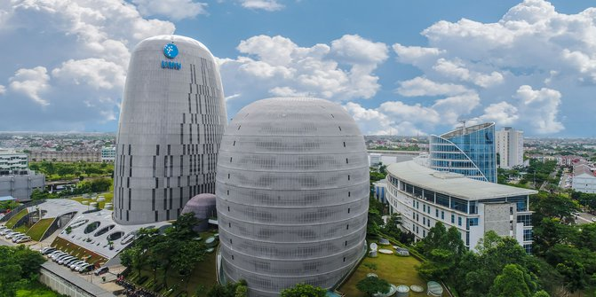
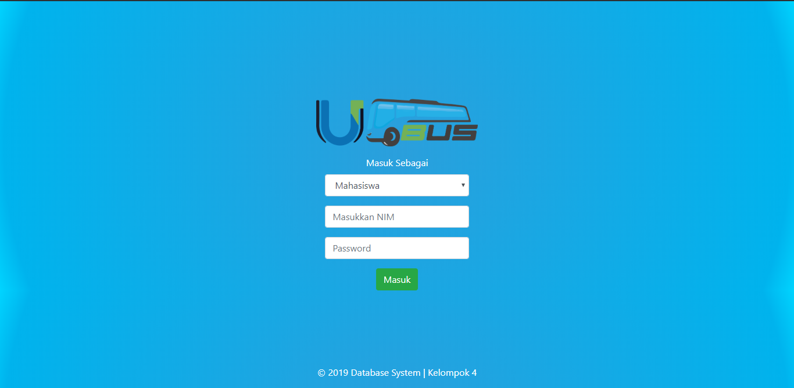
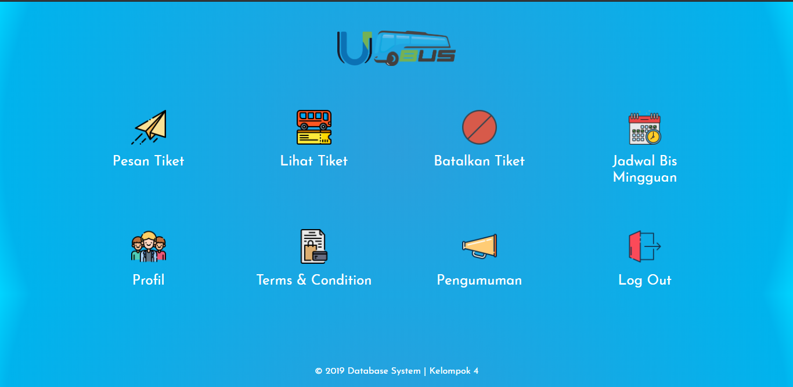
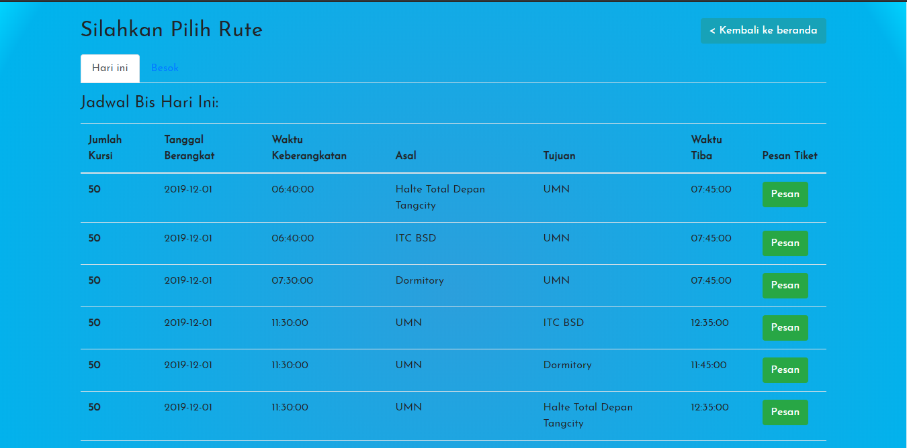
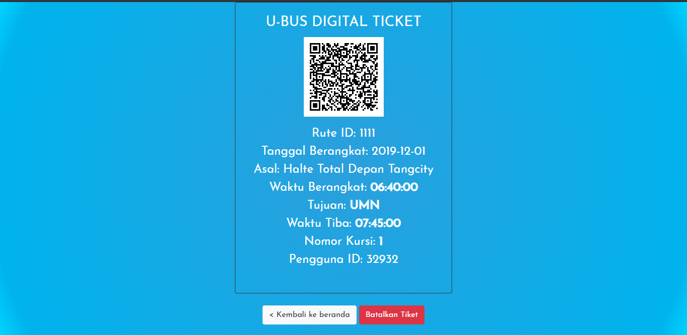
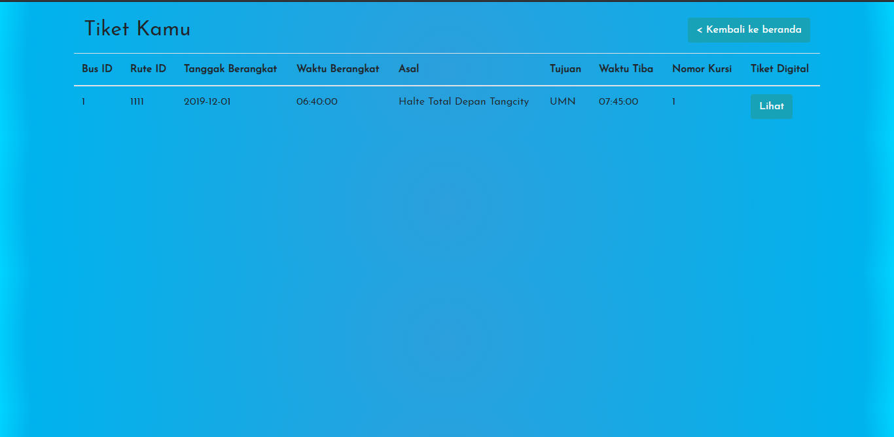
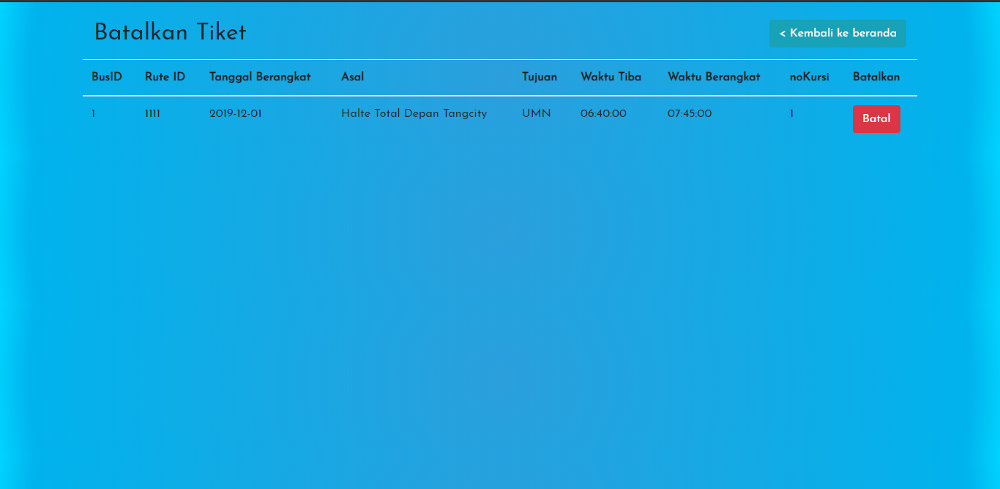
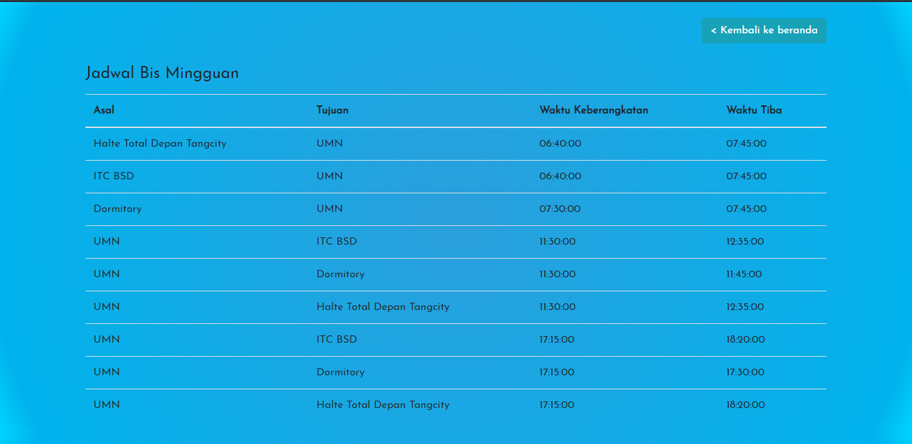

# U-Bus

## Fitur
- Login (sesuai NIM/ID)
- Memesan tiket
- Melihat tiket
- Membatalkan tiket

## Instalasi
- Download semua file
- Taruh di htdocs XAMPP
- Buat database dengan nama "umn-bus-baru" di MySQL Server
- Import SQL File dari folder database (gunakan yang umn-bus-baru)

## Author
- [Jericho Siahaya]( https://github.com/jerichosiahaya )
- [Ricky Ng]( https://github.com/rickyreplying )
- [Darren Riota]( https://github.com/VDarrenRiota )
- [Chezar Ramadhan]( https://github.com/Chezar17 ) (membuat logo)

## Documentation
- Login Page

- Beranda

- Pesan Tiket

- Digital Ticket

- Lihat Tiket

- Batalkan Tiket

- Jadwal Bus

#### <i>Major Update<i>
<i>Ganti nama database di koneksi.php, db-init.php dan db-ts.php (di dalam folder components) dengan nama database yang ingin dipakai. Gunakan database terbaru "umn-bus-baru" yang terdapat di dalam folder database. <bold> Jika muncul error saat pertama kali login, langsung direfresh, error itu karena timeout XAMPP yang diset 30 detik, sedangkan database ini butuh lebih dari 30 detik saat pertama kali login.</bold><i> Gunakan NIM dan Sandi yang ada pada tabel 'pengguna', atau gunakan NIM: 32932 dan Sandi: richo1901.
